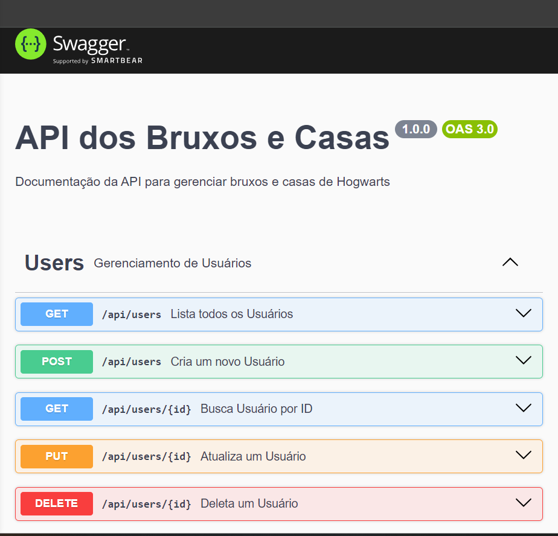

# 🪑🎲 Back-Banco
#### Este projeto foi desenvolvido como parte do curso técnico em Desenvolvimento de Sistemas do SENAI Valinhos, na disciplina de Back-End com o objetivo de aprimorar nossos conhecimentos no Back-End e Banco de dados.

# 📚 Descrição do Projeto
#### O repositório contém informações sobre uma integração entre as matérias de Back-End e Banco de Dados

# 🛠 Técnologias Utilizadas
#### -⚡ JavaScript
#### -👩‍💻 Postman
#### -🐘 PSQL

## 🔗 Acesse a documentação do Postman

#### Para acessar clique aqui, https://documenter.getpostman.com/view/43016771/2sAYk8tMuN

## 🔗 Documentação do Swagger

